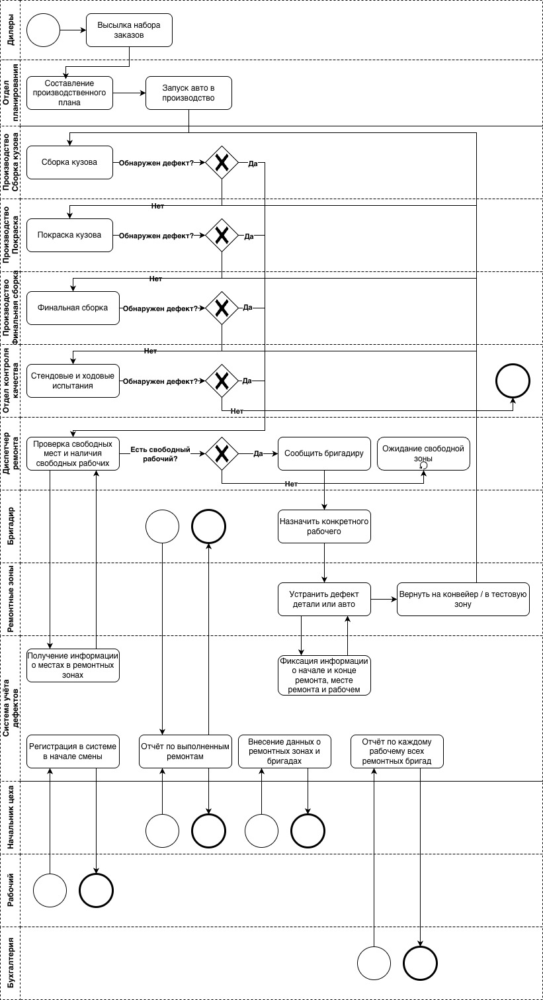

1. [Диаграмма случаев использования](./use_case.drawio.png)

2. [Диаграмма активностей](./Action_diagram.drawio.png)

# Диаграмма активностей

Данная диаграмма демонстрирует процесс **регистрации и устранения дефекта**, возникающего на конвейере автомобильного завода.  
Она описывает взаимодействие между следующими участниками: **Производство**, **Диспетчер**, **Система**, **Бригадир**, **Рабочий** и **Отдел контроля качества**.

---

## Производство
- **Обнаружить дефект** — на конвейере фиксируется наличие дефекта.  
- **Снять авто с конвейера** — автомобиль с дефектом выводится из потока производства.

---

## Диспетчер
- **Проверить свободную ремонтную зону** — осуществление поиска ремонтной зоны.  
- Диспетчер ставит автомобиль в **очередь** при отсуствии ремонтной зоны.  
- При наличии свободного места диспетчер **направляет автомобиль в ремонтную зону**.

---

## Система
- **Зарегистрировать обнаружение дефекта** — вносится информация о дате, месте и причине дефекта, а также данные автомобиля.  
- **Зафиксировать начало ремонта** — система отмечает время начала работ и закреплённого исполнителя.  
- **Зафиксировать выполнение ремонта** — после устранения неисправности фиксируется завершение работ.  
- **Переоткрыть дефект** — если при повторных испытаниях дефект не устранён, система возвращает автомобиль в процесс ремонта.

---

## Бригадир
- **Проверить доступного рабочего** — бригадир ищет свободного ремонтника.  
- При отсутствии доступных работников бригадир **ожидает доступности рабочего**.  
- При появлении доступного сотрудника бригадир **выдаёт задание рабочему**.

---

## Рабочий
- **Получить задание после регистрации доступности** — ремонтник отмечает начало своей смены и готовность к работе.  
- **Диагностика дефекта** — работник проводит анализ дефекта автомобиля и готовит автомобиль к устранению неисправности.

---

## Отдел контроля качества
- **Повторить испытания** — после завершения ремонта автомобиль проходит повторные проверки.  
- Если испытания **не пройдены**, автомобиль возвращается в ремонт.  
- Если испытания **успешны**, автомобиль **отправляется обратно на конвейер (продолжение производства)**.

---

## Общее описание процесса
Участниками обнаруживается дефект и снимается автомобиль с конвейера.  
Диспетчер направляет его в доступную ремонтную зону, после чего система регистрирует дефект и назначает исполнителя.  
Бригадир распределяет задачу между рабочими, а после завершения ремонта автомобиль проходит повторное тестирование.  
В случае успешного прохождения проверок автомобиль возвращается в производственный поток на конвейер.

4. [BPMN-диаграмма](./defects_BPMN_diagram.jpg)

